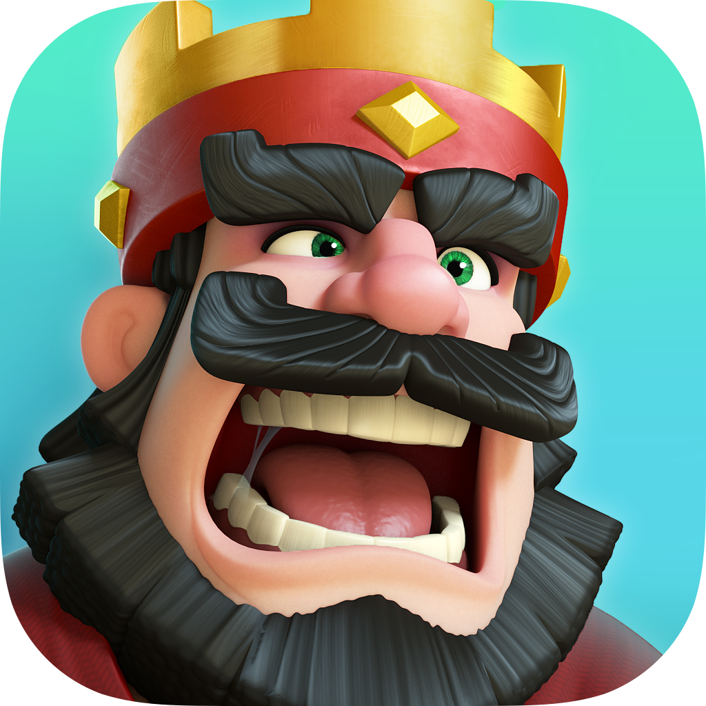

  

<h1 align="center">⚔️ Google Play Games Clash Royale Controls 👑</h1>

This project provides a custom key mapping setup for **Clash Royale** when running the game via **Google Play Games**.
## 📜 Script
`GPG-CONTROLS:Chljb20uc3VwZXJjZWxsLmNsYXNocm95YWxlEAIimAQK9wMSXAoBMRoDCgEIIhgKCTIwMjQuMTIuMBDnzrmu/dGy99YBGAMoATo2CAESCg3zGpo+FZQ+aT8aCg1226Q+FdSebj9SGggBEgoN8xqaPhWUPmk/GgoNdtukPhXUnm4/ElwKATIaAwoBCSIYCgkyMDI0LjEyLjAQv87jrfrYl7bSARgDKAE6NggBEgoNymsAPxU3xWg/GgoNC8wFPxV3JW4/UhoIARIKDcprAD8VN8VoPxoKDQvMBT8VdyVuPxJcCgEzGgMKAQoiGAoJMjAyNC4xMi4wEIOLpsSogr+ilgEYAygBOjYIARIKDWwoLz8VN8VoPxoKDa2IND8VdyVuP1IaCAESCg1sKC8/FTfFaD8aCg2tiDQ/FXclbj8SXAoBNBoDCgELIhgKCTIwMjQuMTIuMBCx1dew6qPx+fsBGAMoATo2CAESCg3Ka1g/FdpLaD8aCg0MzF0/FRusbT9SGggBEgoNymtYPxXaS2g/GgoNDMxdPxUbrG0/EmEKBkVtb3RlcxoDCgEHIhgKCTIwMjQuMTIuMBDjjsqY1Onh9KwBGAMoATo2CAESCg1eQ7k9FacYVT8aCg1sReQ9Fed4Wj9SGggBEgoNXkO5PRWnGFU/GgoNbEXkPRXneFo/GhgKCTIwMjQuMTIuMBDP6qz1+/DfrJgBGAMgARgBKhgKCTIwMjQuMTIuMBCP4/yZkP6R2t0BGAMwAQ==`

## 🚀 Installation

1.  Install **Google Play Games** from the official site.
    
2.  Download and launch **Clash Royale**
    
3.  Open the **Options**  via `Shift + Tab`
    
4.  Click **Remap Controls**

5. Click **Import Controls**  & Paste the script from above
