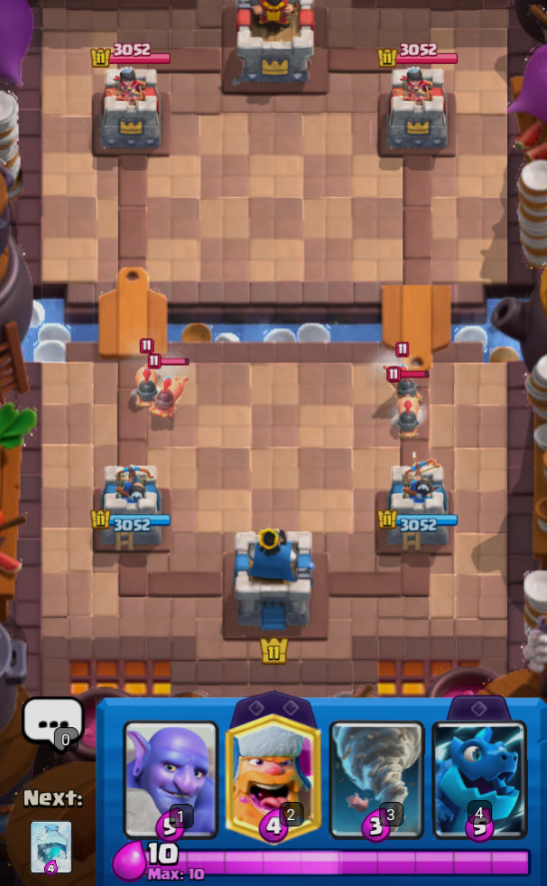

  

<h1 align="center">⚔️ Google Play Games Clash Royale Controls 👑</h1>

  Custom key mapping setup for <b>Clash Royale</b> when running the game via <b>Google Play Games</b>.

---

## 📜 Script

Copy this script and import it into **Google Play Games**:

`GPG-CONTROLS:Chljb20uc3VwZXJjZWxsLmNsYXNocm95YWxlEAIimAQK9wMSXAoBMRoDCgEIIhgKCTIwMjQuMTIuMBDnzrmu/dGy99YBGAMoATo2CAESCg3zGpo+FZQ+aT8aCg1226Q+FdSebj9SGggBEgoN8xqaPhWUPmk/GgoNdtukPhXUnm4/ElwKATIaAwoBCSIYCgkyMDI0LjEyLjAQv87jrfrYl7bSARgDKAE6NggBEgoNymsAPxU3xWg/GgoNC8wFPxV3JW4/UhoIARIKDcprAD8VN8VoPxoKDQvMBT8VdyVuPxJcCgEzGgMKAQoiGAoJMjAyNC4xMi4wEIOLpsSogr+ilgEYAygBOjYIARIKDWwoLz8VN8VoPxoKDa2IND8VdyVuP1IaCAESCg1sKC8/FTfFaD8aCg2tiDQ/FXclbj8SXAoBNBoDCgELIhgKCTIwMjQuMTIuMBCx1dew6qPx+fsBGAMoATo2CAESCg3Ka1g/FdpLaD8aCg0MzF0/FRusbT9SGggBEgoNymtYPxXaS2g/GgoNDMxdPxUbrG0/EmEKBkVtb3RlcxoDCgEHIhgKCTIwMjQuMTIuMBDjjsqY1Onh9KwBGAMoATo2CAESCg1eQ7k9FacYVT8aCg1sReQ9Fed4Wj9SGggBEgoNXkO5PRWnGFU/GgoNbEXkPRXneFo/GhgKCTIwMjQuMTIuMBDP6qz1+/DfrJgBGAMgARgBKhgKCTIwMjQuMTIuMBCP4/yZkP6R2t0BGAMwAQ==`

---

## 🚀 Installation

1. Install **Google Play Games** from the [official site](https://play.google.com/googleplaygames).  
2. Download and launch **Clash Royale**.  
3. Open the **Options Menu** via `Shift + Tab`.  
4. Click **Remap Controls**.  
5. Select **Import Controls** and paste the script above.  

---

## 🎮 In-Game Look

  

